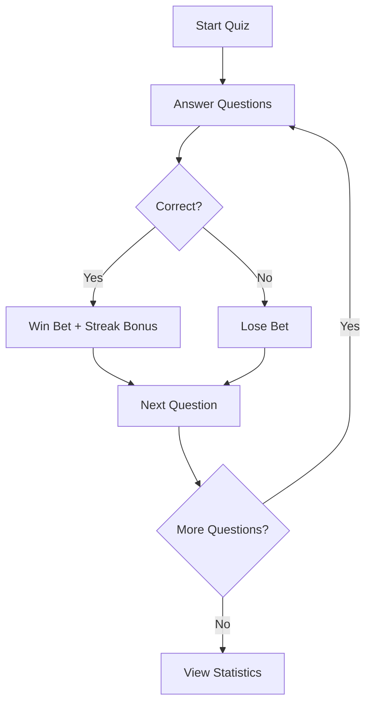

<div align="center">

# 🌟 **QUIZMASTER NEON** 🌟

[](https://opensource.org/licenses/MIT)


## **✨ Electrify Your Knowledge ✨**

</div>

---

<div align="center">
  
### **THE ULTIMATE NEON-STYLED QUIZ EXPERIENCE** 
  
</div>

> *"QuizMaster Neon doesn't just test your knowledge - it transforms the experience into a thrilling neon adventure."*

---

## ⚡ **FEATURES THAT DAZZLE** ⚡

<table>
  <tr>
    <td width="50%" align="center">
      <br>
      <b>🎮 ELECTRIFYING INTERFACE</b>
    </td>
    <td width="50%" align="center">
      <br>
      <b>💰 DYNAMIC BETTING SYSTEM</b>
    </td>
  </tr>
  <tr>
    <td width="50%" align="center">
      <br>
      <b>🔥 REWARDING STREAKS</b>
    </td>
    <td width="50%" align="center">
      <br>
      <b>📊 DETAILED STATISTICS</b>
    </td>
  </tr>
</table>

---

## 💫 **WHY QUIZMASTER NEON?** 💫

```
┌────────────────────────────────────────────────────┐
│                                                    │
│   🧠 KNOWLEDGE + 🎲 GAMBLING + 🌈 NEON DESIGN      │
│   ═════════════════════════════════════════════    │
│        THE PERFECT TRIVIA EXPERIENCE               │
│                                                    │
└────────────────────────────────────────────────────┘
```

<div align="center">
  
### **FEAST YOUR EYES ON THESE UNIQUE ELEMENTS**


</div>

---

## 🚀 **KEY FEATURES** 🚀

- ### **Vibrant Neon UI**
  > *Immerse yourself in an electrifying visual experience with glowing elements and atmospheric design*

- ### **Betting Mechanism**
  > *Risk your points on each question – the higher your streak, the more you can win!*

- ### **Strategic 50/50 Lifeline**
  > *Eliminate two wrong answers – but use it wisely, it costs 10 points from your bankroll!*

- ### **Dynamic Streaks**
  > *Build up consecutive correct answers to boost your multiplier and win bigger rewards*

- ### **Comprehensive Statistics**
  > *Track your performance with detailed stats and history to optimize your strategy*

---

<div align="center">

## 🎮 **GAMEPLAY OVERVIEW** 🎮

</div>

<details>
<summary><b>📋 GAME FLOW (Click to expand)</b></summary>
<br>



</details>

---

## 🎨 **NEON COLOR PALETTE** 🎨

<div align="center">

`#0ff` • `#b300ff` • `#ff00ff` • `#00ff80` • `#ffff00`

<table>
  <tr>
    <td width="20%" bgcolor="#0ff"><br><br></td>
    <td width="20%" bgcolor="#b300ff"><br><br></td>
    <td width="20%" bgcolor="#ff00ff"><br><br></td>
    <td width="20%" bgcolor="#00ff80"><br><br></td>
    <td width="20%" bgcolor="#ffff00"><br><br></td>
  </tr>
</table>

</div>

---

## 💎 **DISTINCTIVE DESIGN ELEMENTS** 💎

- **Glowing Text & Borders** 
  - *Text shadows create an authentic neon sign effect*
- **Gradient Buttons** 
  - *Vibrant color transitions with subtle glow effects*
- **Dark Background** 
  - *Deep gray-black backdrop to make neon colors pop*
- **Reactive UI Elements** 
  - *Visual feedback for user interactions*
- **Card-Based Layout** 
  - *Clean organization with smooth rounded corners*

---

## 📱 **FULLY RESPONSIVE** 📱

<div align="center">
  
### **LOOKS STUNNING ON ANY DEVICE**

<table>
  <tr>
    <td></td>
    <td></td>
    <td></td>
  </tr>
  <tr>
    <td align="center">Mobile</td>
    <td align="center">Tablet</td>
    <td align="center">Desktop</td>
  </tr>
</table>

</div>

---

## 🛠️ **INSTALLATION** 🛠️

```bash
# Clone this electrifying repository
git clone https://github.com/yourusername/quizmaster-neon.git

# Navigate to the project directory
cd quizmaster-neon

# Install dependencies
npm install

# Start the development server
npm start

# Build for production
npm run build
```

---

<div align="center">

## 🌟 **READY TO LIGHT UP YOUR QUIZ EXPERIENCE?** 🌟

[](https://github.com/yourusername/quizmaster-neon)

⭐ **Star this repo if you find it enlightening!** ⭐

</div>

---

<div align="center">
  


MIT © 2025 QuizMaster Neon

</div>
